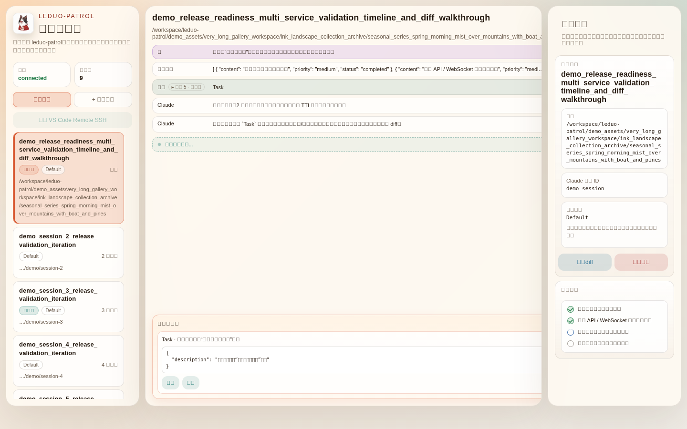
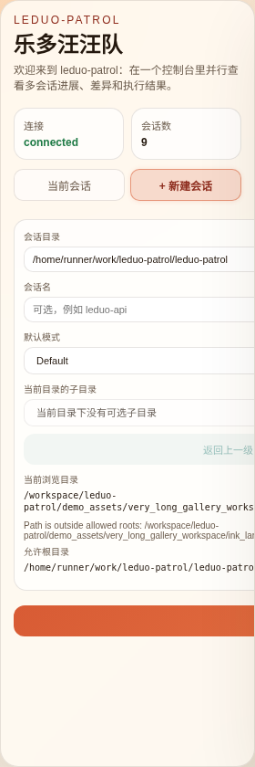
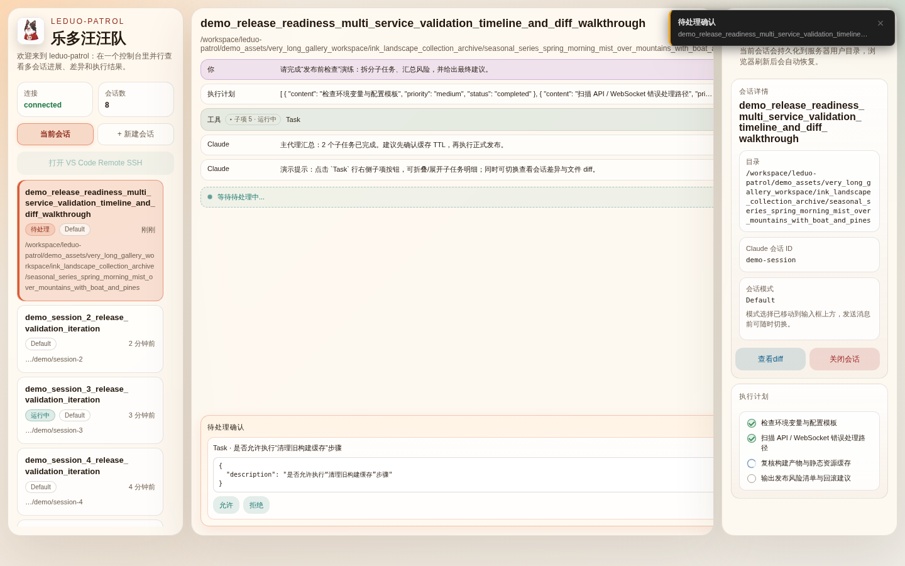
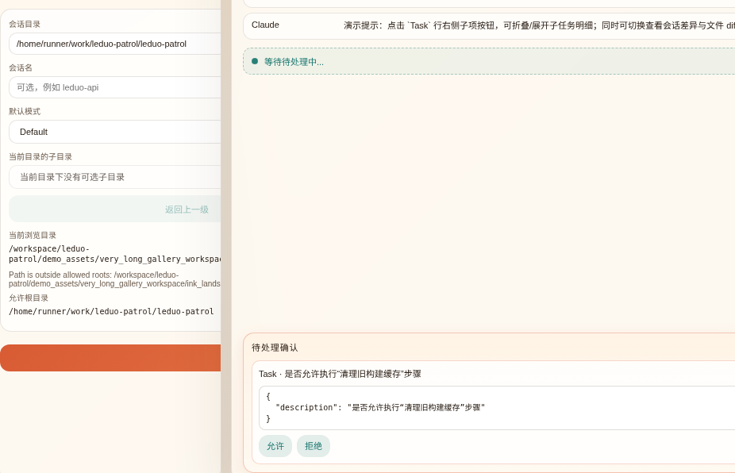
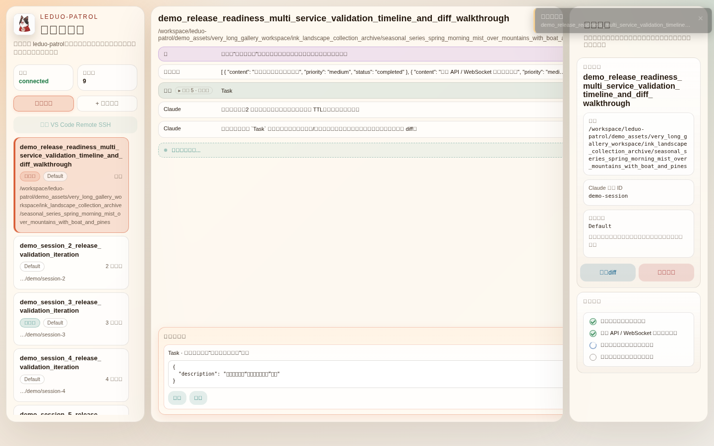
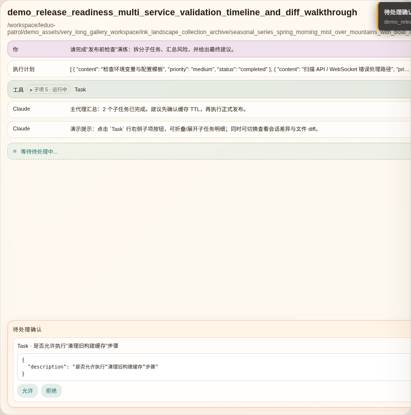
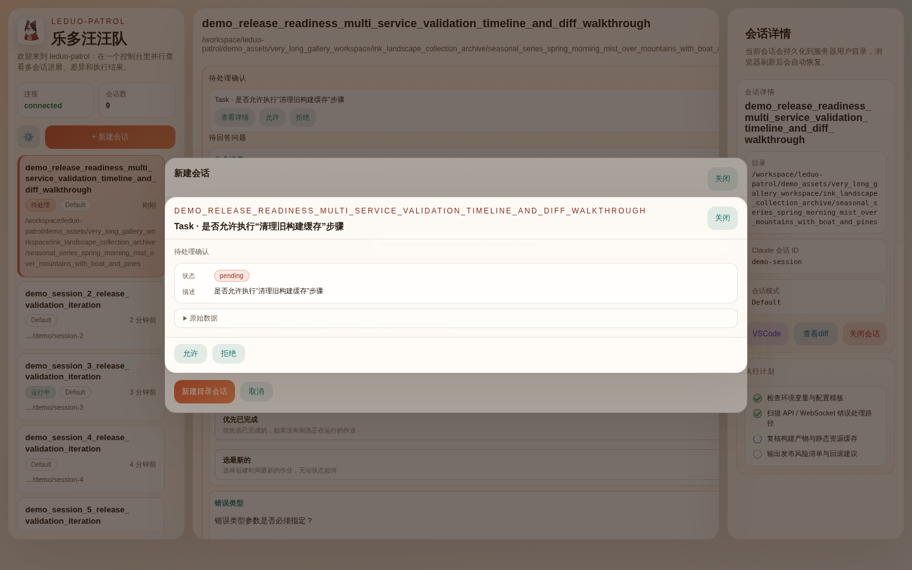

# 乐多汪汪队 / leduo-patrol

一个部署在服务器上的 Web 控制台，用来通过 ACP 驱动 Claude Code，并在浏览器里接收执行流、工具调用和权限确认。

## Showcase

### Walkthrough

**1. 进入控制台：整体布局**



**2. 当前会话 tab（激活态）**


**3. 切换到新建会话 tab**



**4. 对比两个 tab 状态（session）**


**5. 对比两个 tab 状态（create）**


**6. 选择会话卡片**



**7. 查看新建会话表单**



**8. 时间线（SubAgent）展开态**



**9. 时间线（SubAgent）折叠态**



**10. 右侧审批 + 状态面板**



**11. 侧边栏完整视图**


## 功能列表

### 多会话管理
- **并行多会话**：在同一页面管理多个目录会话，各会话有独立时间线、忙碌状态、权限确认与模式状态
- **会话切换**：左侧边栏列出所有会话，点击即切换；当前选中会话有明显的左侧边框高亮与背景着色
- **会话创建**：通过「+ 新建会话」面板指定目录、会话名与默认模式，支持目录浏览器辅助选择路径
- **会话取消 / 关闭 / 恢复**：支持取消进行中的任务、关闭已完成的会话、在错误态下重连恢复
- **服务端持久化**：会话状态写入 `~/.leduo-patrol/state.json`，浏览器刷新后自动恢复会话列表与时间线窗口

### 指令与模式
- **多种执行模式**：支持 `default` / `plan` / `acceptEdits` / `dontAsk` / `bypassPermissions`，创建时可设默认模式，发送消息时可临时覆盖
- **斜杠命令补全**：输入框支持 `/` 前缀的命令名自动补全，列出当前会话可用命令
- **消息发送队列**：会话忙碌时可继续输入，消息会在当前执行完成后自动发送

### 时间线与内容渲染
- **分页时间线**：按窗口展示时间线条目，支持向上加载历史记录，避免一次性渲染过多数据
- **SubAgent 树状折叠**：Task / SubAgent 的起止条目自动归组，可折叠/展开子树，并显示子项计数
- **Markdown 渲染**：Agent 回复与计划详情支持标题、列表、代码块、行内强调与链接
- **Markdown 表格**：时间线中的 Markdown 表格自动解析并以可读格式呈现
- **详情弹窗**：工具调用、计划步骤等复杂内容可点击在弹窗中查看完整原始数据
- **执行计划追踪**：Plan 类型条目解析为步骤列表，每步带完成/待处理状态圆点

### 权限确认
- **右侧审批面板**：待确认的工具调用集中展示在右侧面板，显示工具名与输入预览
- **批准 / 拒绝 / 附加说明**：可直接在 Web 界面批准或拒绝，也可附上文字说明后拒绝
- **待处理计数**：顶部导航显示待确认数量，便于多会话时快速定位

### 差异与文件
- **Session Diff 面板**：查看当前会话工作目录的 Git 差异，区分未暂存、已暂存与未跟踪文件
- **文件内联 Diff**：点击差异文件可在弹窗中查看逐行 diff，支持平铺与按文件两种视图
- **目录浏览**：创建会话时可在允许根目录范围内浏览子目录，安全限制越权访问

### 工具与集成
- **内置终端**：下方可展开终端抽屉，通过 xterm.js 提供完整 PTY 终端体验（需服务端开启 `LEDUO_ENABLE_SHELL=true`）

### 界面与可访问性
- **访问 Key 认证**：所有请求（HTTP / WebSocket）均需携带 key；浏览器检测到无效 key 时展示输入页
- **Toast 通知**：后台事件（新会话、错误、会话恢复）以 toast 形式非侵入提示，支持跳转
- **错误聚合**：全局错误指示器汇总所有应用级错误，点击查看详情
- **键盘友好**：所有交互元素均有 focus-visible 样式，tab 与会话列表支持完整 ARIA 语义
- **响应式过渡**：状态切换（tab、会话选中、按钮 hover）均有平滑过渡动画

## 环境要求

- Node.js 22+
- 已能正常运行 Claude Code
- 服务器环境里已配置 `ANTHROPIC_API_KEY`

## 启动

```bash
npm install
npm run dev
```

默认情况下：

- 前端开发服务运行在自动探测到的可访问内网 IP（优先 `bond* / eth* / ens* / enp*` 网卡）上
- 后端服务运行在 `PORT`（默认 `3001`，端口冲突时会自动递增寻找可用端口）
- 启动日志只打印一个推荐访问地址，避免 `br-*`、`veth*` 等虚拟网卡地址干扰

- 开发模式下 `Access URL` 会优先打印前端 Web 端口（默认 `5173`，可通过 `LEDUO_PATROL_WEB_PORT` 指定），避免误用 server 端口

> 说明：`npm run dev -- --host 0.0.0.0` 不会把参数透传到 `vite`，因为该命令实际启动的是 `concurrently`。本项目会在 `vite.config.ts` 内自动选择一个可访问的内网地址用于开发访问。

生产构建：

```bash
npm run build
npm start
```

> 开发者向的编程与验证测试技巧请见 `AGENTS.md`。

## 可选环境变量

```bash
PORT=3001
LEDUO_PATROL_WEB_PORT=5173
LEDUO_PATROL_APP_NAME=乐多汪汪队
LEDUO_PATROL_WORKSPACE_PATH=/absolute/workspace/path
LEDUO_PATROL_ALLOWED_ROOTS=/absolute/workspace/path,/another/allowed/root
ANTHROPIC_API_KEY=sk-...
LEDUO_PATROL_ACCESS_KEY=your-fixed-key
LEDUO_PATROL_AGENT_BIN=/absolute/path/to/claude-code-acp
LEDUO_ENABLE_SHELL=true
```

如果设置了 `LEDUO_PATROL_ALLOWED_ROOTS`，网页中只能连接这些根目录之下的路径；未设置时默认只允许启动命令所在目录。
如果未设置 `LEDUO_PATROL_WORKSPACE_PATH`，默认工作目录为启动命令所在目录（`process.cwd()`），并在启动日志中提示如何通过环境变量修改。
如果未设置 `LEDUO_PATROL_ALLOWED_ROOTS`，默认允许根目录同样为启动命令所在目录，并会在启动日志中提示可配置项。

## 状态持久化

服务会把会话状态写到用户目录下：

```bash
~/.leduo-patrol/state.json
```

其中包含：

- 管理中的会话列表
- 每个会话的工作目录、模式与最近状态
- 浏览器刷新后用于恢复界面的基础数据

## 访问校验 Key

服务启动时会自动生成一次性访问 key，并在控制台打印可直接打开的地址。

- 开发模式（`npm run dev`）下，`Access URL` 默认指向 Web 端口（默认 `5173`）。
- 生产模式（`npm start`）下，Web 由同一个 Express 服务静态托管，因此不会出现独立的 Web 监听端口；`Access URL` 会指向 server 端口。若未找到打包后的 `dist/web` 资源，服务会给出错误提示页与启动日志提示。

浏览器访问、前端 API 请求和 WebSocket 连接都需要携带这个 `key` 参数；未携带或错误会返回 `401 Unauthorized`。

前端页面在检测到 URL 缺少 `key` 或 `key` 失效时，会先展示一个 key 输入页，粘贴后可直接进入控制台。

如需固定 key，可设置：

```bash
LEDUO_PATROL_ACCESS_KEY=your-fixed-key
LEDUO_PATROL_AGENT_BIN=/absolute/path/to/claude-code-acp
```

## 已知限制

- 当前只实现了 Claude Code
- 目前终端能力没有暴露给 ACP client，先聚焦网页指令和确认流

> SubAgent 树状折叠 demo 的开发说明（含 demo 数据维护、截图流程）请见 `AGENTS.md`。


## 打包并发布为 npm 包

可以把本项目作为一个可安装的 Node 服务发布：

```bash
npm run build
npm pack
```

`npm pack` 会生成一个 `.tgz` 包，其他人可以这样安装并运行：

```bash
npm install -g ./leduo-patrol-1.0.0.tgz
leduo-patrol
```

如果要发布到 npm registry：

```bash
npm login
npm publish
```

建议发布前先检查打包内容：

```bash
npm pack --dry-run
```
