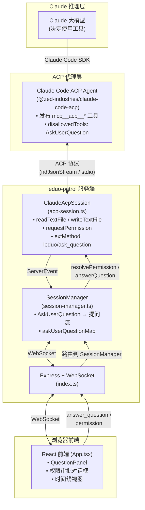
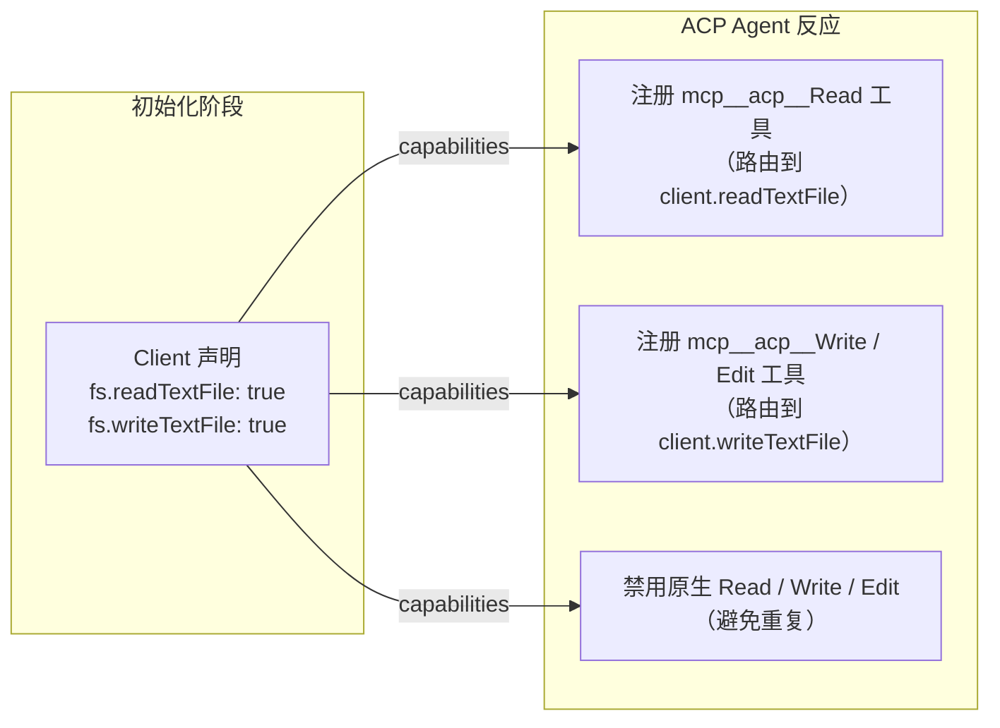
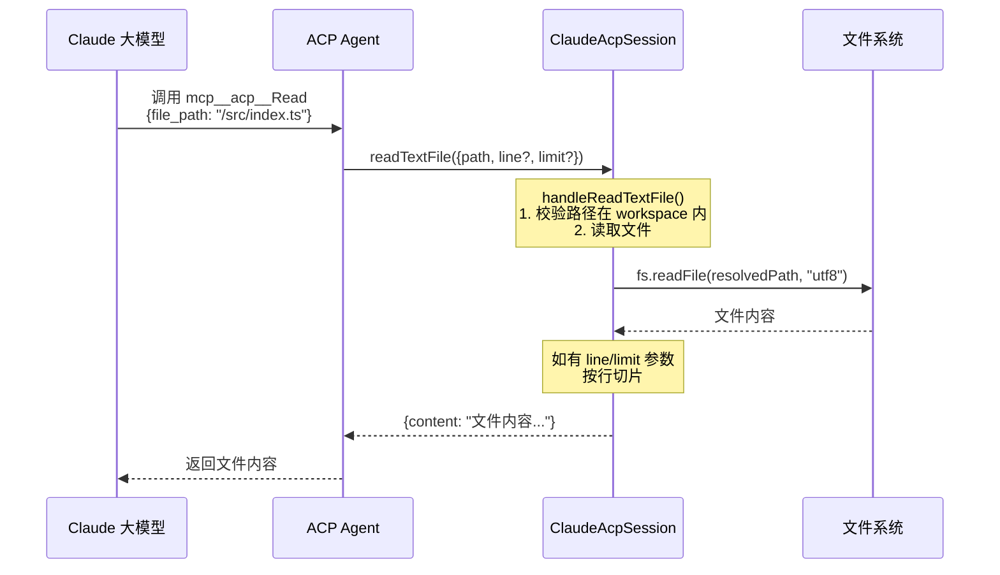
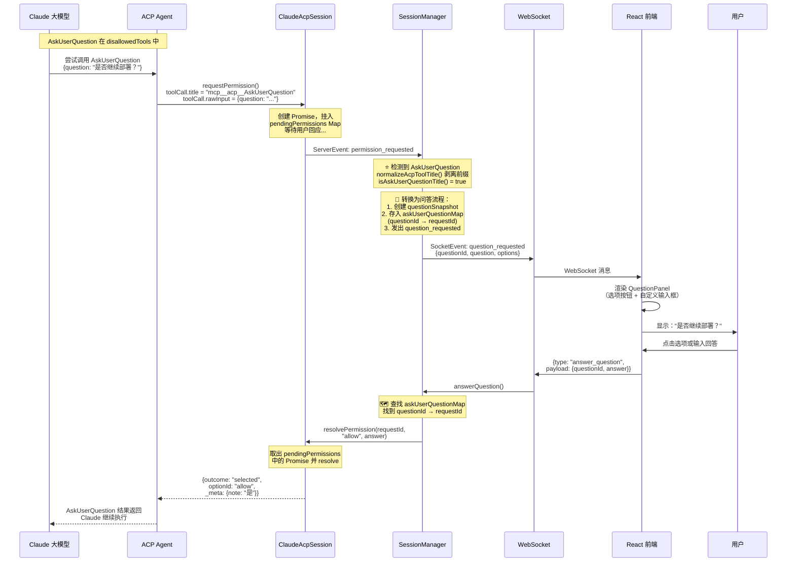
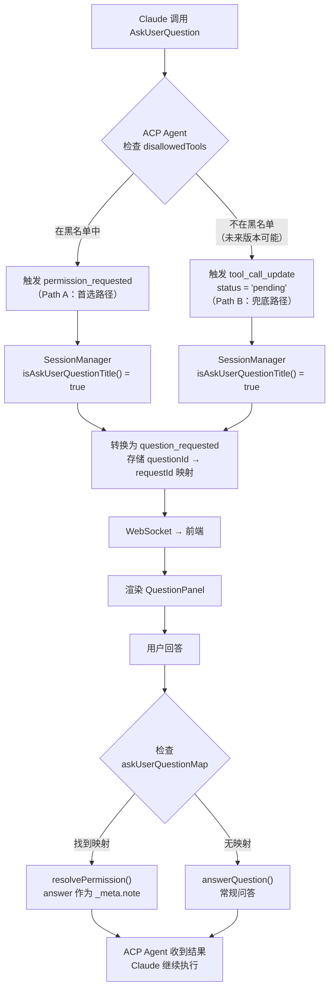
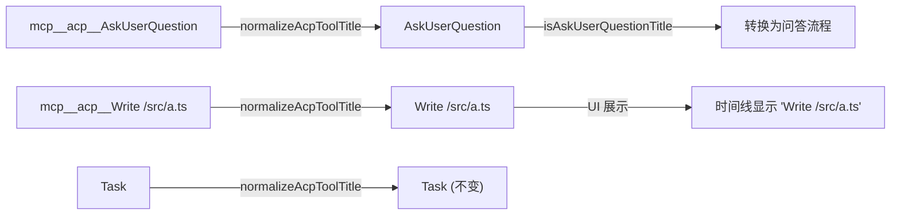

# ACP 交互架构：Read / Write / AskUserQuestion

本文档描述 leduo-patrol 如何通过 **Agent Client Protocol (ACP)** 与 Claude Code 交互，
实现文件读写（Read / Write）和用户提问（AskUserQuestion）三大核心能力。

---

## 目录

1. [整体架构](#1-整体架构)
2. [clientCapabilities 声明](#2-clientcapabilities-声明)
3. [Read 文件读取流程](#3-read-文件读取流程)
4. [Write 文件写入流程](#4-write-文件写入流程)
5. [AskUserQuestion 用户提问流程](#5-askuserquestion-用户提问流程)
6. [mcp\_\_acp\_\_ 前缀与 normalizeAcpToolTitle](#6-mcp__acp__-前缀与-normalizeacptooltitle)
7. [关键数据结构](#7-关键数据结构)
8. [代码索引](#8-代码索引)

---

## 1. 整体架构

leduo-patrol 的核心思路是：**把自己当作 ACP 客户端，为 Claude Code 提供文件系统和用户交互能力**。

```
┌─────────────────────────────────────────────────────────────────────────┐
│  Claude 大模型                                                          │
│  （推理引擎，决定使用哪些工具）                                            │
└────────────────────────┬────────────────────────────────────────────────┘
                         │  Claude Code SDK 内部调用
                         ▼
┌─────────────────────────────────────────────────────────────────────────┐
│  Claude Code ACP Agent （@zed-industries/claude-code-acp）               │
│                                                                         │
│  • 以子进程（stdio）方式被 leduo-patrol 启动                              │
│  • 将 Claude 原生工具重新发布为 MCP 工具（加 mcp__acp__ 前缀）             │
│  • 管理工具白名单 / 黑名单                                                │
│  • AskUserQuestion 默认在 disallowedTools 列表中                         │
└────────────────────────┬────────────────────────────────────────────────┘
                         │  ACP 协议（ndJsonStream over stdio）
                         ▼
┌─────────────────────────────────────────────────────────────────────────┐
│  ClaudeAcpSession （server/acp-session.ts）                              │
│                                                                         │
│  实现 acp.Client 接口：                                                  │
│  ├── readTextFile()       → handleReadTextFile()   文件读取              │
│  ├── writeTextFile()      → handleWriteTextFile()  文件写入              │
│  ├── requestPermission()  → handlePermissionRequest() 权限审批           │
│  └── extMethod()          → handleExtMethod()      自定义扩展            │
│                                                                         │
│  维护两个 Promise Map：                                                  │
│  • pendingPermissions   等待用户审批                                     │
│  • pendingQuestions     等待用户回答                                     │
└────────────────────────┬────────────────────────────────────────────────┘
                         │  ServerEvent 对象
                         ▼
┌─────────────────────────────────────────────────────────────────────────┐
│  SessionManager （server/session-manager.ts）                            │
│                                                                         │
│  • 管理多个 ManagedSession 的完整生命周期                                 │
│  • 检测 AskUserQuestion 并转换：                                         │
│    permission_requested → question_requested                            │
│  • 维护 askUserQuestionMap (questionId → requestId) 做反向映射            │
│  • 时间线、快照持久化                                                    │
└────────────────────────┬────────────────────────────────────────────────┘
                         │  WebSocket (SocketEvent JSON)
                         ▼
┌─────────────────────────────────────────────────────────────────────────┐
│  Express + WebSocket Server （server/index.ts）                          │
│                                                                         │
│  接收 ClientCommand：                                                    │
│  • { type: "answer_question", payload: { questionId, answer } }         │
│  • { type: "permission", payload: { requestId, optionId, note? } }      │
│                                                                         │
│  广播 SocketEvent 到所有连接的前端                                        │
└────────────────────────┬────────────────────────────────────────────────┘
                         │  WebSocket JSON
                         ▼
┌─────────────────────────────────────────────────────────────────────────┐
│  React 前端 （src/App.tsx）                                              │
│                                                                         │
│  • 接收 question_requested  → 渲染 QuestionPanel                        │
│  • 接收 permission_requested → 渲染权限审批对话框                         │
│  • 用户操作后发送 answer_question / permission 命令                       │
│  • normalizeAcpToolTitle() 在 UI 层剥离 mcp__acp__ 前缀                  │
└─────────────────────────────────────────────────────────────────────────┘
```

### Mermaid 架构图



---

## 2. clientCapabilities 声明

在建立 ACP 连接时，leduo-patrol 需要告诉 Agent **自己能提供哪些能力**：

```typescript
// server/acp-session.ts — connect()
await this.connection.initialize({
  protocolVersion: acp.PROTOCOL_VERSION,
  clientCapabilities: {
    fs: {
      readTextFile: true,   // ← 我能处理文件读取
      writeTextFile: true,  // ← 我能处理文件写入
    },
    _meta: {
      extensions: [
        {
          method: "leduo/ask_question",
          description: "Ask the user a question with optional options..."
        }
      ]
    }
  },
});
```

**作用机制：**



| 能力声明 | Agent 行为 | 说明 |
|---------|-----------|------|
| `fs.readTextFile: true` | 注册 `mcp__acp__Read`，禁用原生 `Read` | 文件读取走 Client 路由 |
| `fs.writeTextFile: true` | 注册 `mcp__acp__Write` / `mcp__acp__Edit`，禁用原生 `Write` / `Edit` | 文件写入走 Client 路由 |
| `_meta.extensions` | 注册自定义方法 `leduo/ask_question` | 可通过 `extMethod` 调用 |

> **不声明 fs 能力会怎样？** Agent 会让 Claude 使用原生 Read/Write 工具直接操作文件系统。
> 但这些原生工具在 ACP 子进程内部运行，无法被 leduo-patrol 监控和拦截，
> 导致 Write 操作出现 `status: "failed"` 的错误。

---

## 3. Read 文件读取流程



**核心代码：**

```typescript
// server/acp-session.ts
private async handleReadTextFile(params: schema.ReadTextFileRequest) {
  // 1. 解析路径（绝对路径直接用，相对路径拼接 workspace）
  const filePath = path.isAbsolute(params.path)
    ? params.path
    : this.resolveWorkspacePath(params.path);

  // 2. 读取整个文件
  const content = await readFile(filePath, "utf8");

  // 3. 如果有行号/行数限制，做切片
  if (params.line != null || params.limit != null) {
    const lines = content.split("\n");
    const offset = (params.line ?? 1) - 1;
    const limit = params.limit ?? lines.length;
    return { content: lines.slice(offset, offset + limit).join("\n") };
  }

  return { content };
}
```

---

## 4. Write 文件写入流程

```mermaid
sequenceDiagram
    participant Claude as Claude 大模型
    participant Agent as ACP Agent
    participant Session as ClaudeAcpSession
    participant FS as 文件系统

    Claude->>Agent: 调用 mcp__acp__Write<br/>{file_path: "/src/config.ts",<br/>content: "export const v = '1.0';"}
    Agent->>Session: writeTextFile({path, content})
    Note over Session: handleWriteTextFile()<br/>1. 校验路径在 workspace 内<br/>2. 创建父目录<br/>3. 写入文件
    Session->>FS: fs.mkdir(dirname, {recursive: true})
    Session->>FS: fs.writeFile(path, content, "utf8")
    FS-->>Session: 写入成功
    Session-->>Agent: {} (空对象 = 成功)
    Agent-->>Claude: 写入完成
```

**核心代码：**

```typescript
// server/acp-session.ts
private async handleWriteTextFile(params: schema.WriteTextFileRequest) {
  // 1. 解析路径
  const filePath = path.isAbsolute(params.path)
    ? params.path
    : this.resolveWorkspacePath(params.path);

  // 2. 确保父目录存在
  await mkdir(path.dirname(filePath), { recursive: true });

  // 3. 写入文件
  await writeFile(filePath, params.content, "utf8");

  return {};  // 空对象 = 成功
}
```

**Write 报错排查**：如果看到类似下面的错误，说明 clientCapabilities 没有正确声明 `fs.writeTextFile: true`：

```json
{
  "toolCallId": "tool-7a45ce89...",
  "title": "Write",
  "status": "failed",
  "rawOutput": ""
}
```

---

## 5. AskUserQuestion 用户提问流程

这是三个流程中**最复杂**的。AskUserQuestion 被 ACP Agent 默认**禁用**，
Claude 尝试调用它时会触发 `permission_requested` 事件。leduo-patrol 拦截这个事件，
将其**转换**为更友好的问答界面。

### 5.1 完整流程时序图



### 5.2 核心转换逻辑

SessionManager 是实现这个「偷梁换柱」的关键：

```typescript
// server/session-manager.ts — handleSessionEvent()
case "permission_requested": {
  const normalizedTitle = normalizeAcpToolTitle(event.payload.toolCall.title);
  //  "mcp__acp__AskUserQuestion" → "AskUserQuestion"

  if (isAskUserQuestionTitle(normalizedTitle)) {
    // ① 从 rawInput 中提取问题文本
    const rawInput = asRecord(event.payload.toolCall.rawInput);
    const questionText = typeof rawInput?.question === "string"
      ? rawInput.question : "";

    // ② 创建一个新的 questionId
    const questionId = randomUUID();

    // ③ 记录映射关系：questionId → 原始 requestId
    this.askUserQuestionMap.set(questionId, {
      clientSessionId,
      requestId: event.payload.requestId,
    });

    // ④ 作为 question_requested 发出（不是 permission_requested）
    entry.snapshot.questions.push({
      clientSessionId,
      questionId,
      question: questionText,
      options: [],
      allowCustomAnswer: true,
    });
    break;  // 跳过后面的权限处理逻辑
  }

  // [其他工具走正常权限流程]
}
```

用户回答后的反向映射：

```typescript
// server/session-manager.ts — answerQuestion()
async answerQuestion(clientSessionId, questionId, answer) {
  const mappedPermission = this.askUserQuestionMap.get(questionId);

  if (mappedPermission) {
    // 这个问题源自 AskUserQuestion 的权限拦截
    this.askUserQuestionMap.delete(questionId);

    // 用 "allow" + answer 解决原始权限请求
    await this.getEntry(clientSessionId)
      .acpSession?.resolvePermission(
        mappedPermission.requestId,
        "allow",
        answer,   // 用户回答作为 _meta.note 传回
      );
    return;
  }

  // 普通问题（来自 leduo/ask_question 扩展）
  await this.getEntry(clientSessionId)
    .acpSession?.answerQuestion(questionId, answer);
}
```

### 5.3 AskUserQuestion 路径对比



---

## 6. mcp\_\_acp\_\_ 前缀与 normalizeAcpToolTitle

### 为什么存在这个前缀？

ACP Agent 将 Claude 的原生工具重新发布为 MCP 工具时，会加上命名空间前缀：

| Claude 原生工具名 | ACP 发布后的 MCP 工具名 |
|------------------|------------------------|
| `Read`           | `mcp__acp__Read`       |
| `Write`          | `mcp__acp__Write`      |
| `Edit`           | `mcp__acp__Edit`       |
| `Bash`           | `mcp__acp__Bash`       |
| `AskUserQuestion`| `mcp__acp__AskUserQuestion` |

### normalizeAcpToolTitle 的作用

在**服务端**和**前端**各有一份相同的剥离函数：

```typescript
// server/session-manager.ts & src/App.tsx
function normalizeAcpToolTitle(rawTitle: unknown): string {
  if (typeof rawTitle !== "string") return "";
  return rawTitle.replace(/^mcp__acp__/i, "");
}
```

**使用场景：**



---

## 7. 关键数据结构

### ServerEvent（ACP 会话 → SessionManager）

```typescript
// server/acp-session.ts
type ServerEvent =
  | { type: "permission_requested"; payload: { requestId, toolCall, options } }
  | { type: "permission_resolved"; payload: { requestId, optionId } }
  | { type: "question_requested"; payload: { questionId, question, options, allowCustomAnswer } }
  | { type: "question_answered"; payload: { questionId, answer } }
  | { type: "session_update"; payload: SessionNotification["update"] }
  | { type: "prompt_started"; payload: { promptId, text } }
  | { type: "prompt_finished"; payload: { promptId, stopReason } }
  | { type: "error"; payload: { message } }
  // ...
```

### askUserQuestionMap（问题 → 权限映射）

```typescript
// server/session-manager.ts
private readonly askUserQuestionMap = new Map<
  string,  // questionId
  {
    clientSessionId: string;
    requestId: string;  // 原始 permission 的 requestId
  }
>();
```

### QuestionSnapshot（前端展示数据）

```typescript
type QuestionSnapshot = {
  clientSessionId: string;
  questionId: string;
  question: string;
  options: Array<{ id: string; label: string }>;
  allowCustomAnswer: boolean;
};
```

---

## 8. 代码索引

| 文件 | 关键位置 | 功能 |
|------|---------|------|
| `server/acp-session.ts` | L142–150 | Client 接口注册（readTextFile / writeTextFile / requestPermission / extMethod） |
| `server/acp-session.ts` | L157–174 | clientCapabilities 声明（fs 能力 + 自定义扩展） |
| `server/acp-session.ts` | L477–496 | handleReadTextFile — 文件读取实现 |
| `server/acp-session.ts` | L498–508 | handleWriteTextFile — 文件写入实现 |
| `server/acp-session.ts` | L395–412 | handlePermissionRequest — 创建 Promise 等待用户审批 |
| `server/acp-session.ts` | L332–347 | resolvePermission — 解决权限请求（含 \_meta.note） |
| `server/session-manager.ts` | L454–487 | permission\_requested 处理 — 检测 AskUserQuestion 并转换为问答流 |
| `server/session-manager.ts` | L300–324 | answerQuestion — 反向映射：question → permission |
| `server/session-manager.ts` | L615–656 | tool\_call / tool\_call\_update — 兜底检测 AskUserQuestion |
| `server/session-manager.ts` | L871–874 | normalizeAcpToolTitle — 剥离 mcp\_\_acp\_\_ 前缀 |
| `server/session-manager.ts` | L1125–1128 | isAskUserQuestionTitle — 判断是否为 AskUserQuestion |
| `server/index.ts` | L255–268 | WebSocket 消息路由 — 分发 permission / answer\_question |
| `src/App.tsx` | L1136–1154 | question\_requested 处理 — 添加到 session.questions 列表 |
| `src/App.tsx` | L1373–1381 | answerQuestion — 发送回答命令到 WebSocket |
| `src/App.tsx` | L4219 | QuestionPanel 组件 — 问答面板 UI |

> **注意**：上述行号基于当前代码版本，后续代码变更可能导致行号偏移。
> 建议搜索函数名或关键标识符来定位。
